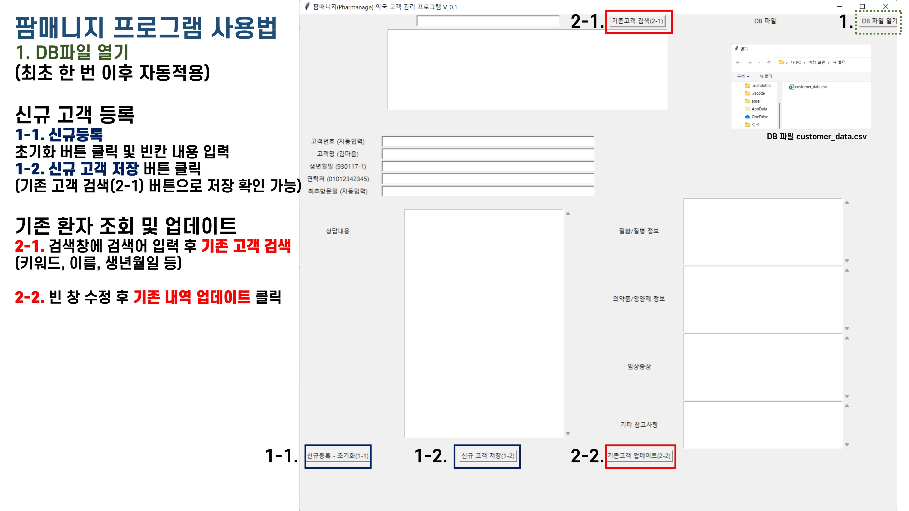

# 팜매니지(Pharmanage)

팜매니지는 지역약국 약사님들을 위해 만들어진 간편한 프로그램입니다.

고객 정보관리를 통해 지역 보건사회의 발전에 도움이 되길 바랍니다.

이 프로그램은 내방고객의 약력관리를 간편하게 할 수 있으며 csv(엑셀)파일 기반으로 데이터를 관리합니다.

일반 유저들이 사용하기 편리한 exe파일은 아래의 링크에서 다운받을 수 있습니다.

[다운로드 링크](https://drive.google.com/drive/folders/1eJyqY2aKbbOOp4lFVY1vQpseJXOaTIWj?usp=sharing, "다운로드")

프로그램은 위 링크의 customer_data.csv 파일과 zip파일을 다운로드 후 압축 해제한 파일을 사용하여 실행할 수 있습니다.

## 사용법

팜매니지는 쉽게 사용할 수 있도록 설치형 프로그램이 아닌 바로 사용(portable)가능한 프로그램으로 구성되어 있습니다.

프로그램을 사용하기 위해서는 customer_data.csv 파일을 불러와서 사용해야 합니다.

한 번 불러오면 config.txt로 경로가 저장되기 때문에 다시 불러올 필요가 없습니다.

많은 양의 데이터 수정이 필요하다면 csv파일을 엑셀을 이용해 얼마든지 수정할 수 있습니다.

## 프로그램 사용법

### Thanks to.
소스코드는 자료를 공유해 주신 서약사님 코드를 수정 및 추가하였습니다.
